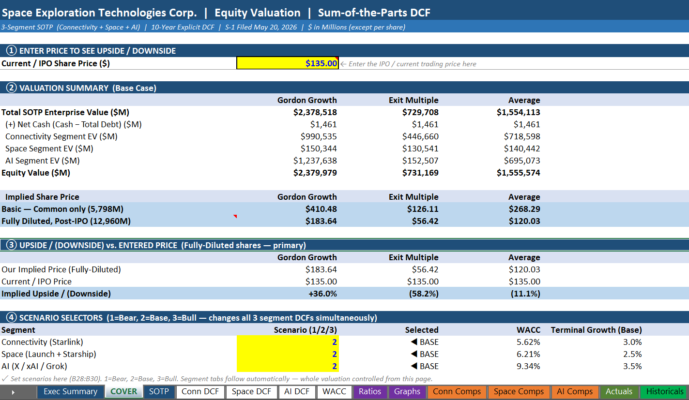

# Investment Case: SpaceX

A research-driven valuation and investment analysis pack for Space Exploration Technologies Corp., covering the business model, operating drivers, valuation framework, source library, and model update process.



## Overview

This repository contains an institutional-style investment case built around a maintained valuation model and supporting research library. The core asset is a sum-of-the-parts DCF model supported by segment-level operating analysis, filings, third-party research, operating datasets, comparable company work, and final output materials.

The model is designed to be updated over time as new filings, operating metrics, funding rounds, comparable company data, and industry research become available. The repository is organized so that sources, assumptions, and outputs can be reviewed and refreshed without rebuilding the analysis from scratch.

## What the Model Contains

The Excel workbook is structured around a control page, segment-level valuation tabs, comparable company analysis, and supporting assumptions.

| Tab | Purpose |
| --- | --- |
| Cover | Control panel, valuation summary, scenario selectors, and upside/downside summary. |
| SOTP | Consolidated sum-of-the-parts valuation. |
| Connectivity DCF | Starlink and connectivity segment valuation. |
| Space DCF | Launch and Starship segment valuation. |
| AI DCF | AI, xAI, and Grok-related segment valuation. |
| WACC | Cost of capital assumptions. |
| Ratios | Financial and valuation ratio analysis. |
| Graphs | Visual outputs and supporting charts. |
| Connectivity Comps | Comparable company analysis for connectivity. |
| Space Comps | Comparable company analysis for launch and space. |
| AI Comps | Comparable company analysis for AI. |
| Actuals | Reported or estimated actual financial data. |
| Historicals | Historical operating and financial assumptions. |

The model is intended to be usable as a working valuation file rather than a static output. Scenario selectors, segment assumptions, comparables, WACC inputs, and historical data can be refreshed as the research base evolves.

## Repository Structure

```text
00_Index.xlsx
01_Filings
02_Investor_Materials
03_Financial_Reporting
04_Research
05_News
06_Operating_Data
07_Model
08_Output
assets
```

`00_Index.xlsx`  
Central index of key sources and files.

`01_Filings`  
Primary filings, regulatory documents, government disclosures, and official source documents.

`02_Investor_Materials`  
Company presentations, investor materials, fundraising documents, factsheets, and management materials.

`03_Financial_Reporting`  
Financial reports, transcripts, earnings materials, conference transcripts, and management commentary.

`04_Research`  
Broker reports, industry reports, competitor research, TAM studies, and valuation research.

`05_News`  
News articles, funding rounds, M&A announcements, major contracts, and important developments.

`06_Operating_Data`  
Model input datasets such as subscriber counts, launch counts, satellite data, pricing, KPIs, and contract tracking.

`07_Model`  
Main Excel valuation model and archived versions.

`08_Output`  
Investment memos, valuation summaries, presentation decks, and final outputs.

`assets`  
Images and supporting repository presentation assets.

## Updating the Model

The repository is designed for periodic maintenance as new information becomes available.

Quarterly updates may include:

- Add new operating data.
- Refresh comparable company trading multiples.
- Update WACC assumptions.
- Update subscriber, launch, pricing, or contract datasets.
- Reconcile new actuals or management commentary.

Annual updates may include:

- Rebuild historical financials.
- Refresh long-term assumptions.
- Update TAM and industry research.
- Review segment-level DCF assumptions.
- Refresh scenario cases.
- Archive prior model versions.

## Investment Pack Contents

This repository is broader than a single Excel workbook. It is intended to function as a complete valuation pack containing:

- Source library.
- Operating data.
- Valuation model.
- Comparable company analysis.
- Research notes.
- Final outputs.

## Intended Use

This repository can be used for:

- Learning valuation modelling.
- Understanding SpaceX's business model.
- Practicing investment research workflows.
- Tracking private-company operating assumptions.
- Building repeatable investment case repositories.

## Repeatable Framework

The structure is designed to be reusable for other company valuation projects. The same workflow can be applied by maintaining a clear source library, separating raw research from operating datasets, keeping the valuation model in a dedicated model folder, and archiving finished outputs separately.

The goal is to make each assumption traceable, each update repeatable, and each output supported by an organized research base.

## Disclaimer

This project is for educational and research purposes only. It is not financial advice, investment advice, or a recommendation to buy or sell any security.
